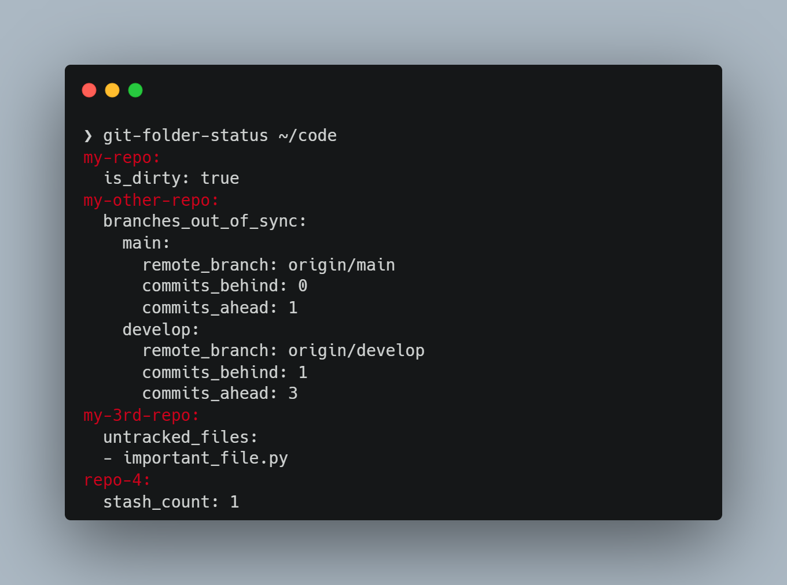

# git-folder-status

[![Tests][tests-badge]][tests-link]
[![uv][uv-badge]][uv-link]
[![Ruff][ruff-badge]][ruff-link]
[![Black][black-badge]][black-link]
[![codecov][codecov-badge]][codecov-link]
\
[![Made Using tsvikas/python-template][template-badge]][template-link]
[![GitHub Discussion][github-discussions-badge]][github-discussions-link]
[![PRs Welcome][prs-welcome-badge]][prs-welcome-link]

## Overview

Scans a directory tree and reports Git repositories that aren't fully synced
with their remote.

A day-to-day tool for when you work across multiple projects and want to keep
everything pushed and backed up. One command instead of running `git status`
in each repo.



### Why not just `git status`?

`git status` only shows uncommitted changes in the current repo. This tool
runs across all repos in a directory tree and catches things `git status`
misses:

- Stash entries
- Detached HEAD
- Branches without a remote
- Branches ahead of or behind remote
- Tags not on remote, or differing from remote (`--slow`)
- Non-repo directories containing files
- Broken symlinks
- And of course, uncommitted changes and untracked files

## Install

Install this tool using pipx (or uv):

```bash
pipx install git+https://github.com/tsvikas/git-folder-status.git
```

## Usage

Run it with:

```bash
git-folder-status /path/to/code/directory
```

Use `git-folder-status --help` to learn more.

## Contributing

Interested in contributing?
See [CONTRIBUTING.md](CONTRIBUTING.md) for development setup and guideline.

[black-badge]: https://img.shields.io/badge/code%20style-black-000000.svg
[black-link]: https://github.com/psf/black
[codecov-badge]: https://codecov.io/gh/tsvikas/git-folder-status/graph/badge.svg
[codecov-link]: https://codecov.io/gh/tsvikas/git-folder-status
[github-discussions-badge]: https://img.shields.io/static/v1?label=Discussions&message=Ask&color=blue&logo=github
[github-discussions-link]: https://github.com/tsvikas/git-folder-status/discussions
[prs-welcome-badge]: https://img.shields.io/badge/PRs-welcome-brightgreen.svg
[prs-welcome-link]: https://opensource.guide/how-to-contribute/
[ruff-badge]: https://img.shields.io/endpoint?url=https://raw.githubusercontent.com/astral-sh/ruff/main/assets/badge/v2.json
[ruff-link]: https://github.com/astral-sh/ruff
[template-badge]: https://img.shields.io/badge/%F0%9F%9A%80_Made_Using-tsvikas%2Fpython--template-gold
[template-link]: https://github.com/tsvikas/python-template
[tests-badge]: https://github.com/tsvikas/git-folder-status/actions/workflows/ci.yml/badge.svg
[tests-link]: https://github.com/tsvikas/git-folder-status/actions/workflows/ci.yml
[uv-badge]: https://img.shields.io/endpoint?url=https://raw.githubusercontent.com/astral-sh/uv/main/assets/badge/v0.json
[uv-link]: https://github.com/astral-sh/uv
