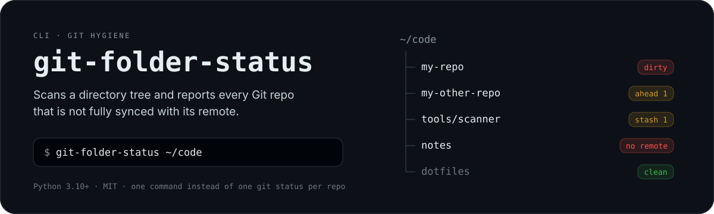
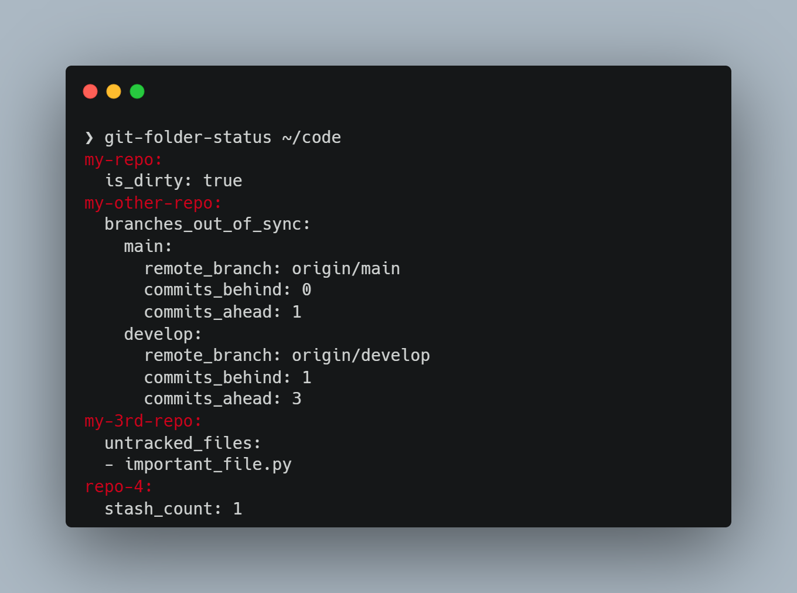

<p align="center">
  
</p>

<p align="center">
<a href="https://github.com/tsvikas/git-folder-status/actions/workflows/ci.yml"></a>
<a href="https://codecov.io/gh/tsvikas/git-folder-status"></a>
<a href="https://github.com/astral-sh/uv"></a>
<a href="https://github.com/astral-sh/ruff"></a>
<a href="https://github.com/psf/black"></a>
<br>
<a href="https://github.com/tsvikas/python-template"></a>
<a href="https://github.com/tsvikas/git-folder-status/discussions"></a>
<a href="https://opensource.guide/how-to-contribute/"></a>
</p>

## What it looks like



Point it at the folder where you keep your projects.
It walks the tree, inspects every Git repo it finds, and prints only the ones holding work that is not safely on a remote.

## Install

```bash
pipx install git+https://github.com/tsvikas/git-folder-status.git
```

`uv tool install` works the same way.
Requires Python 3.10 or newer.

## Use

```bash
git-folder-status ~/code
```

By default it recurses 3 levels deep and prints a colored report of repos with issues.

| Option                 | Short | Does                                                   |
| ---------------------- | ----- | ------------------------------------------------------ |
| `--recurse N`          | `-r`  | Max depth to descend into directories (default 3)      |
| `--exclude-dir NAME`   | `-d`  | Skip these directories. Repeatable                     |
| `--format FMT`         | `-f`  | Output as `report`, `yaml`, `json`, or `pprint`        |
| `--empty`              | `-e`  | Also list repos that have no issues                    |
| `--all`                | `-a`  | Show extra info for each repo, not just issues         |
| `--slow`               | `-s`  | Enable expensive checks, currently tag comparison      |
| `--include-behind`     | `-b`  | Also flag branches that are only behind the remote     |
| `--external-worktrees` | `-w`  | Analyze worktrees living outside the scanned directory |

Use `--format json` or `--format yaml` to pipe the results into another tool.

## Why not just `git status`?

`git status` covers one repo, and only its working tree.
This tool covers a whole tree of repos, and catches states that `git status` stays quiet about:

- Uncommitted changes and untracked files
- Stash entries you forgot about
- Detached HEAD
- Branches with no remote at all
- Branches ahead of or behind their remote
- Tags missing from the remote, or differing from it (`--slow`)
- Non-repo directories that still contain files
- Broken symlinks

Linked worktrees of the same repo are grouped under their main worktree.
Repo-level state such as stashes, branches, and tags is reported once instead of repeated for every worktree.

## Contributing

See [CONTRIBUTING.md](CONTRIBUTING.md) for development setup and guidelines.

Licensed under the MIT License.
